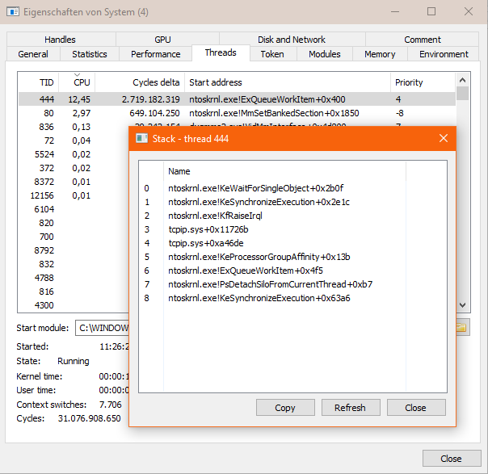
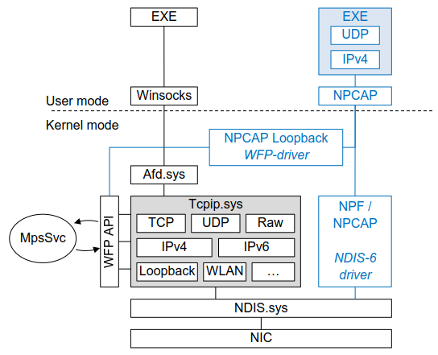

[](https://opensource.org/licenses/Apache-2.0)

[](https://github.com/eclipse-ecal/udpcap/actions/workflows/build-windows.yml)

# Udpcap = UDP + Npcap

Udpcap is a receive-only UDP-Socket emulation based on Npcap. It utilizes the Npcap packet capture driver to capture ethernet traffic, parse all necessary headers and return the UDP Payload.
With Udpcap you can open a UDP Socket and receive data without actually opening a Socket!

The Project is Windows only, as Npcap only targets Windows as well.

## Features & Limitations

Udpcap **can**:
- Bind to an IPv4 address and a port
- Set the receive buffer size
- Join and leave multicast groups
- Enable and disable multicast loopback
- Receive unicast and multicast packages (Only one memcpy from kernel to user space memory)
- Handle fragmented IPv4 traffic

Udpcap **cannot**:
- Send data _(use an actual socket for that 😉)_
- Set bind flags ("sockets" are always opened shared)
- Use IPv6

## Dependencies:

- [Npcap](https://npcap.com/)
- [Pcap++](https://pcapplusplus.github.io/)
- [asio](https://github.com/chriskohlhoff/asio.git)

All dependencies are conveniently fetched by CMake. For actually using Udpcap however, the Npcap driver needs to be installed. Keep in mind that the Npcap license is proprietary.


# Why does this need to exist?

Using a packet capture driver to emulate a UDP socket sounds like a terrible idea, when you could just use a proper UDP Socket? Well, it probably is. But hang on, there is a very specific Windows issue that this project can work around.

Compared to Windows 7, Windows 10 has a more aggressive Windows Defender (The MpsSvc Service). When receiving many **UDP multicast** packets with a regular socket on Windows 10, the Windows Defender causes a massive CPU load making the entire system laggy. The issue appears to be worse, when the Windows machine is connected to a Windows Domain, as it is usally done in large corporation networks.
When investigating the System with Process Hacker, one can see that the `System` process (the Windows Kernel) occupies as much as an entire CPU core. It is always one thread inside the kernel that that uses up all CPU cycles and it has `tcpip.sys` in its call stack:



The Defender Firewall cannot be deactivated in Windows 10 any more. The MpsSvc Service will even keep running when temporarily deactivated, as it offers further security features besides the Defender Firewall.

## How Udpcap works

On Windows, every (user space initiated) network access uses the Winsocks/2 API. That API uses the Kernel-Mode filesystem driver `Afd.sys`, which then uses the Transport Protocol Driver `tcpip.sys`. The tcpip.sys driver is where all the Protocol magic happens in Windows. This is also the point where the Windows Defender Firewall analyzes the traffic. Microsoft has created an entire API only for that purpose: The Windows Filtering Platform (WFP). This API is available in Windows Vista and later. Below `tcpip.sys` only comes the `NDIS.sys` (Network Driver Interface Specification) and the actual Ethernet NIC drivers. So to work around the Defender Firewall CPU load issue, we need to bypass the entire `tcpip.sys` driver and everything above it. Refer to the image below (black lines) to get an overview. When using Npcap, the Windows Defender does not see any open sockets and does not analyze the traffic. This however means that the UDP protocol stack has to be re-implemented in user space _(that's where Udpcap comes in handy!)_.



# Example

Udpcap has a very simple API with strong similarities to other well-known socket APIs:

```cpp
#include <iostream>
#include <udpcap/udpcap_socket.h>

int main()
{
  // Create a Udpcap socket and bind it to a port. For this exampel we want to
  // receive data from any local or remote source and therefore not bind to an
  // IP address.
  
  Udpcap::UdpcapSocket socket;

  socket.bind(Udpcap::HostAddress::Any(), 14000);

  for (;;)
  {
    // Receive a datagram from the Socket. This is a blocking
    // operation. The operation will return once a datagram has been received,
    // the socket was closed by another thread or an error occured.
    std::vector<char> received_datagram = socket.receiveDatagram();

    std::cout << "Received " << received_datagram.size() << " bytes: "
              << std::string(received_datagram.data(), received_datagram.size())
              << std::endl;
  }

  return 0;
}

```

# How to compile Udpcap & Samples

You will need git-for-windows, Visual Studio 2015 or newer and CMake 3.13 or newer to compile Udpcap.

1. Clone this repo

    _(Alternatively you can download this repo as archive. There are no submodules.)_

    ```bat
    git clone https://github.com/eclipse-ecal/udpcap.git
    cd udpcap
    ```

2. Call `CMakeWindows.bat`

    This will also download the following dependencies:
    
    - asio (header only)
    - Npcap SDK (as binary `.lib` files)
    - Pcap++ (as binary `.lib` files)

3. Open `_build/udpcap.sln` with Visual Studio and compile `udpcap` and the samples

    For seeing some output from the samples, you will obviously have to always execute both the sender snd udpcap_reciever sample.

## CMake Options

You can set the following CMake Options to control how Udpcap is supposed to build:

**Option**                                     | **Type** | **Default** | **Explanation**                                                                                                 |
|----------------------------------------------|----------|-------------|-----------------------------------------------------------------------------------------------------------------|
| `UDPCAP_BUILD_SAMPLES`                       | `BOOL`   | `ON`        | Build the Udpcap (and asio) samples for sending and receiving dummy data                                        |
| `UDPCAP_THIRDPARTY_ENABLED`                  | `BOOL`   | `ON`        | Activate / Deactivate the usage of integrated dependencies.                                                     |
| `UDPCAP_THIRDPARTY_USE_BUILTIN_NPCAP`        | `BOOL`   | `ON`        | Fetch and build against an integrated Version of the npcap SDK. <br>Only available if `UDPCAP_THIRDPARTY_ENABLED=ON` |
| `UDPCAP_THIRDPARTY_USE_BUILTIN_PCAPPLUSPLUS` | `BOOL`   | `ON`        | Fetch and build against an integrated Version of Pcap++. <br>_Only available if `UDPCAP_THIRDPARTY_ENABLED=ON`_        |
| `UDPCAP_THIRDPARTY_USE_BUILTIN_ASIO`         | `BOOL`   | `ON`        | Fetch and build against an integrated Version of asio. <br>Only available if `UDPCAP_THIRDPARTY_ENABLED=ON`          |
| `CMAKE_BUILD_SHARED_LIBS`                    | `BOOL`   |             | Not a udpcap option, but use this to control whether you want to have a static or shared library                |
# How to integrate Udpcap in your project

**Integrate as binaries**:

1. Download a udpcap release or build it as described earlier. If you build yourself, make sure to build and install both a debug and release version.

2. If you chose the **shared** udpcap library (-> `.dll`), it will be self-contained and you only need to copy the `udpcap.dll` / `udpcapd.dll` to your application directory.

    If you chose the **static** udpcap library (-> `.lib`), you need to make the following targets available for CMake as well:
    
    - `pcapplusplus::pcapplusplus`
    - `npcap::npcap` 

    Check out the [Udpcap integration sample](samples/integration_test/CMakeLists.txt) for a suggestion on how to do that. You can find the scripts and modules for fetching and finding Npcap and Pcap++ here:

    - [thirdparty/npcap](thirdparty/npcap)
    - [thirdparty/pcapplusplus](thirdparty/pcapplusplus)

3. Add the udpcap directory to your `CMAKE_PREFIX_PATH`:
   
   ```bash
   cmake your_command_line -DCMAKE_PREFIX_PATH=path/to/udpcap/install/dir
   ```

**Integrate as source**

1. Make the udpcap source available either way. You can e.g. download it manually, use a git submodule or use CMake FetchContent.

2. Add the following to your `CMakeLists.txt`:

    ```cmake
    # You will probably not need the samples, so turn them off.
    set(UDPCAP_BUILD_SAMPLES OFF)

    # Add the top-level directory as cmake subdirectory
    add_subdirectory("path_to_udpcap")

    # Add the dummy Findudpcap.cmake do the module path to make
    # find_package(udpcap) succeed.
    list(APPEND CMAKE_MODULE_PATH "path_to_udpcap/thirdparty/udpcap/Modules")
    ```

3. Now you can link against `udpcap::udpcap`
